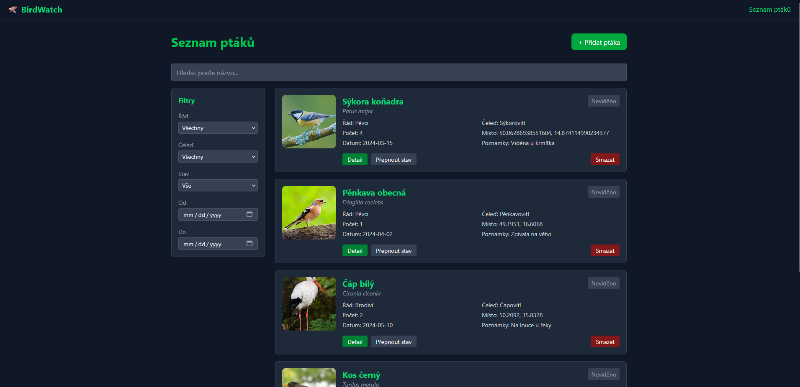
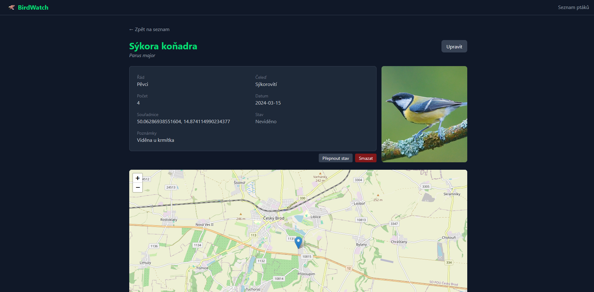
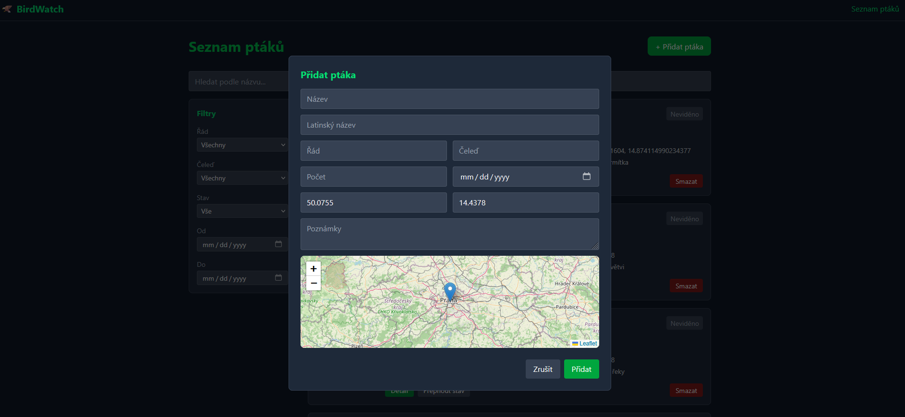
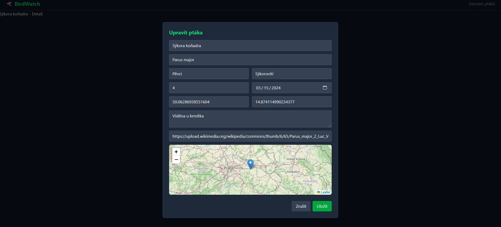

# BirdWatch 🦅

A digital field journal for birdwatchers to record and manage their bird sightings.

## Description

BirdWatch allows users to log birds they have spotted, including details such as species name, latin name, order, family, location (via interactive map), date, count, and personal notes. The app supports adding, editing, and deleting records, filtering by various criteria, and viewing sighting locations on a map.

## Features

- Add, edit, and delete bird sightings
- Filter birds by order, family, name, seen status, and date range
- Interactive map to select sighting location (react-leaflet)
- Bird detail page with map showing sighting location
- Optional photo via URL
- Data persisted in localStorage — survives page refresh
- Dark theme UI

## Technologies

- React + TypeScript
- Vite
- TanStack Query (data fetching)
- React Router DOM (routing)
- React Leaflet (maps)
- Tailwind CSS (styling)
- Vitest + React Testing Library (testing)

## Limitations

- The project is frontend-only with no backend. Initial data is loaded from `public/birds.json` via TanStack Query.
- Images are supported via URL only — there is no file upload due to the absence of a backend.
- Data added by the user is stored in localStorage and will not persist across different browsers or devices.
- The app does not support multiple users or accounts.

## Installation

```bash
git clone https://github.com/Mikulas-code/4IT427_bilm18_sem.git
cd 4IT427_bilm18_sem
npm install
npm run dev
```

## Running Tests

```bash
# Run tests in terminal
npm run test

# Run tests with visual UI in browser
npm run test:ui

# Run tests with coverage report
npm run test:coverage
```

## Screenshots



